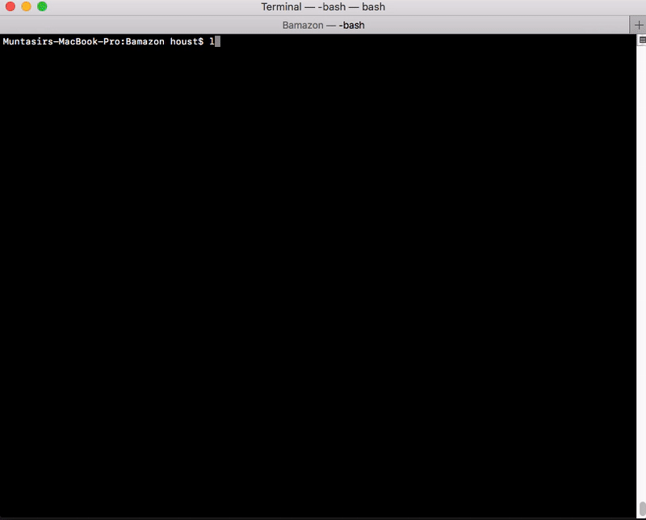
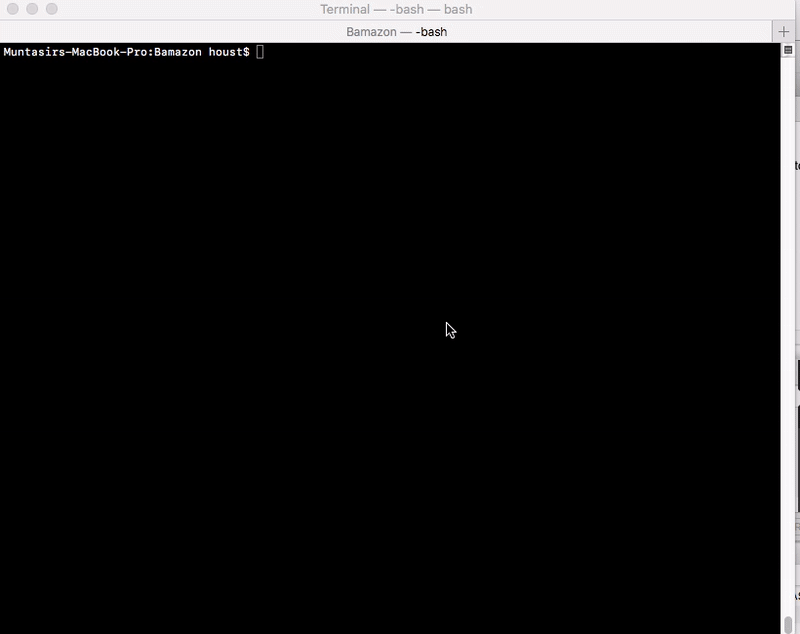

# Bamazon

An Amazon-like command line interface storefront with applications for the Customer, Store Manager, and Supervisor.

## Project Motivation

This app was developed as part of the Node.js and MySQL homework assignment at the University of Toronto Full Stack Web Development bootcamp. This project is a testament to the mastery of advanced Node.js concepts that include interaction with MySQL relational database to execute complex queries which ultimately resulted in a practical app that is simple yet powerful in its features and functionality.

## Environment Setup
1) Download and Install the latest version of [Node.js](https://nodejs.org/en/download/) on you computer.
2) Download and Install [MySQL Community Server](https://dev.mysql.com/downloads/mysql/). Create a database login with "root" as the username and set the database server to run on the port 3306 (3306 is the default port). For development and demo purposes, the password should be changed to an empty string (`""`) using the command on line 5 in the [schema.sql](./db/schema.sql) file. Make sure the server is up and running before executing the app.

## Getting Started

1) Either download the zipped project from GitHub or clone the repo into your local machine.  
The rest of the steps need to be executed on the Terminal:  
2) Cd into the directory Bamazon.
3) To install all the dependency packages in the project locally, run: `npm install`
4) To create the database and tables as well as seed the database with 'mock' data, execute: `npm run-script initializeDb`
5)    
	* To run the Bamazon app as a Customer, execute: `node bamazonCustomer.js` or `npm run-script customer`
	* To run the Bamazon app as a Store Manager, execute: `node bamazonManager.js` or `npm run-script manager`
	* To run the Bamazon app as a Supervisor, execute: `node bamazonSupervisor.js` or `npm run-script supervisor`

## App Demo
### Bamazon Customer App  
  
[Bamazon Customer App Video Demo](./app-demo/customer.mov)  

### Bamazon Manager App  
  
[Bamazon Manager App Video Demo](./app-demo/manager.mov)  

### Bamazon Supervisor App  
  
[Bamazon Supervisor App Video Demo](./app-demo/supervisor.mov)  

## Getting Help

If help is needed to understand something in the app or just to provide feedback/suggestion, please send an email to muntasir2165@hotmail.com

## Author

**Muntasir Biojid** - [GitHub Profile](https://github.com/muntasir2165)
